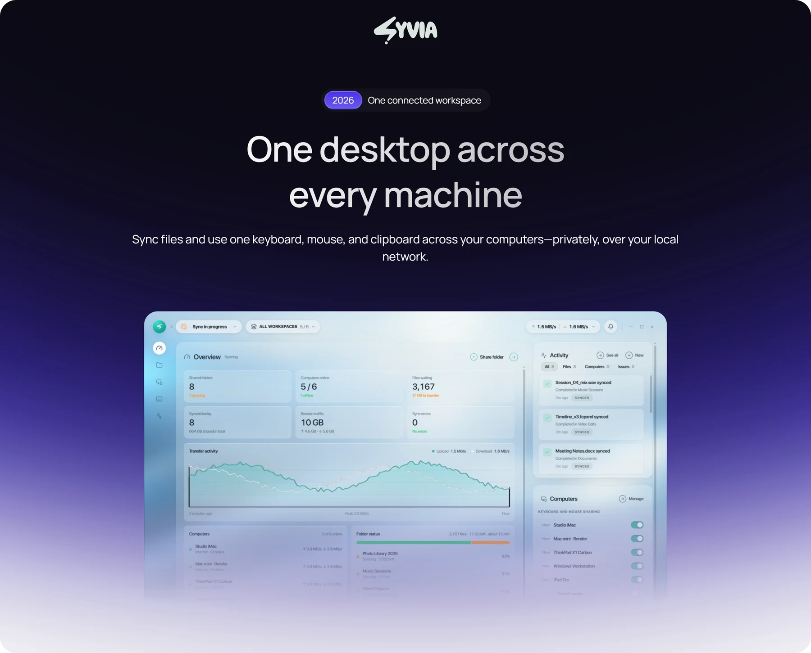
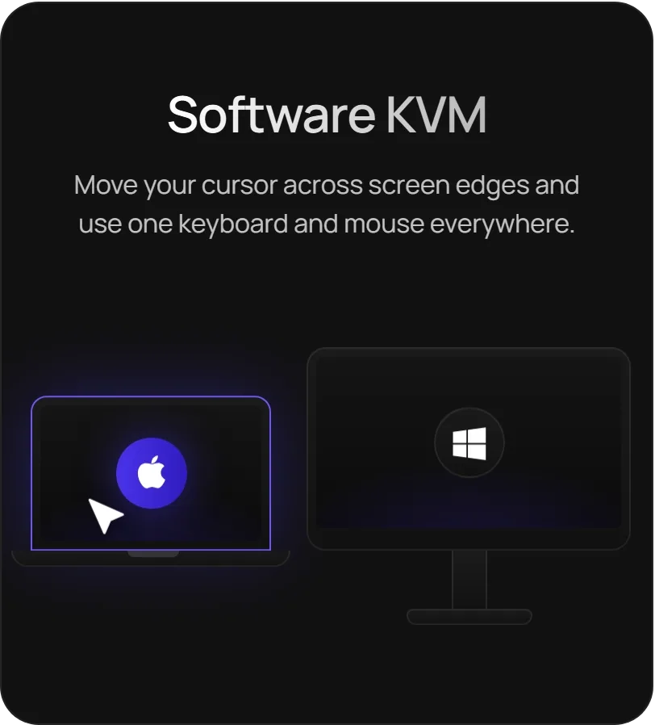
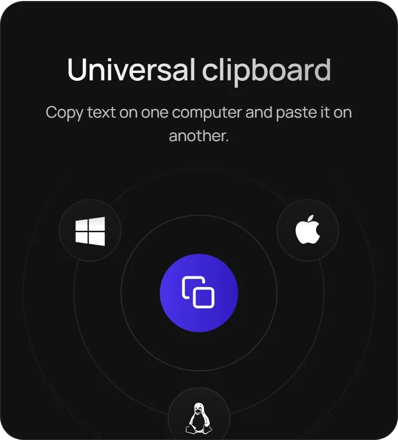
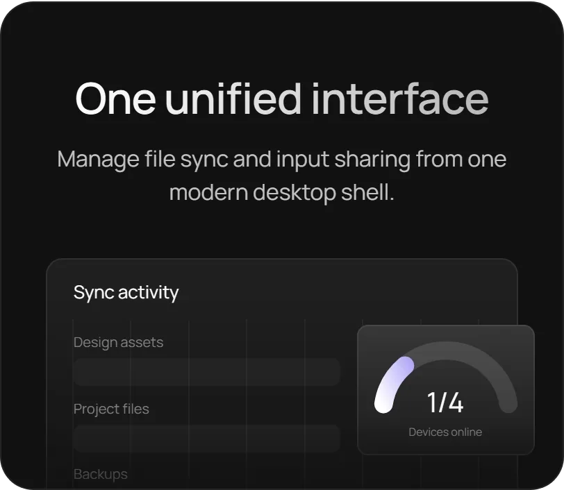
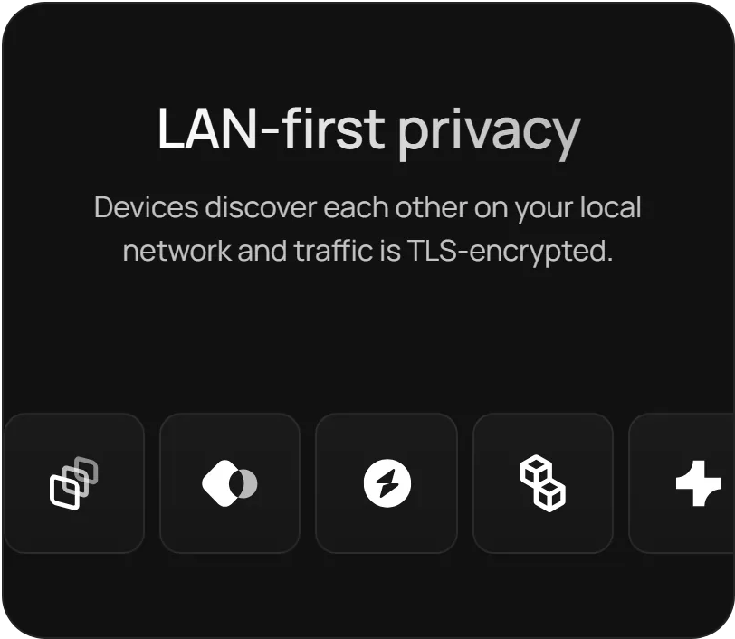

<p align="center">

</p>

<p align="center">
<a href="https://github.com/slyrhtml/sysvia-release/releases/latest"><b>Download for Windows</b></a>
&nbsp;·&nbsp;
<a href="#install">Install</a>
&nbsp;·&nbsp;
<a href="#set-up-a-desk">Set up a desk</a>
&nbsp;·&nbsp;
<a href="#reference">Reference</a>
</p>

## What it does

<p align="center">


</p>

<p align="center">


</p>

## Install

Download the installer for your computer from the [latest release](https://github.com/slyrhtml/sysvia-release/releases/latest). A Linux installer is not available yet.

**Windows (x64).** Run `Sysvia-1.0.1-win-x64.exe`. It installs per machine, asks for a directory (default `C:\Program Files\Sysvia`), and adds Start menu and desktop shortcuts. It also adds Windows Firewall allow rules for Sysvia's two background services. Uninstalling removes the rules and leaves your folders and settings alone.

**macOS.** Open the `.dmg` from the release and drag Sysvia into Applications. On first launch macOS asks for Local Network access, and keyboard and mouse sharing needs the permissions listed under [macOS permissions](#macos-permissions).

The app checks this repository for updates shortly after launch and every few hours.

<details>
<summary>Verify the download</summary>

<br>

The SHA256 of each installer is in [SHA256SUMS](SHA256SUMS). To check your copy:

```powershell
# Windows
Get-FileHash .\Sysvia-1.0.1-win-x64.exe -Algorithm SHA256
```

```sh
# macOS
shasum -a 256 ~/Downloads/Sysvia-1.0.1-*.dmg
```

</details>

## Set up a desk

Install and open Sysvia on each computer. Then:

1. On the computer whose keyboard you want to use, open **Desk** and choose **Host this desk**.
2. On the other computer, choose **Join** and enter the host's LAN address. Desk can copy it for you.
3. Wait for that computer to appear under **Active sessions**. "Nearby" only means a discovery packet arrived.
4. Open the layout, snap the other computer to the edge it physically sits on, and apply.
5. Push the pointer off that edge.

> [!NOTE]
> Both computers must be open and on the same subnet. A desktop on Ethernet and a laptop on a different Wi-Fi range will not see each other.

Keyboard sharing is optional. Leaving it off does not stop folder sync, and folders can also reach each other beyond the LAN through discovery and relays. The desk cannot.

### Shortcuts

| Shortcut | What it does |
| --- | --- |
| `Ctrl+Alt+Esc` | Take the pointer back if it sticks on the other computer. On a Mac: `Control+Option+Esc`. |
| `Ctrl+Alt+2` | Show the other computer's primary display on this monitor. Press it again or `Esc` to close. On a Mac: `Control+Option+2`. |

<details>
<summary id="macos-permissions">macOS permissions</summary>

<br>

- **Local Network** must be allowed so Sysvia can find your other computers.
- **Accessibility** must be on for Sysvia and for `sysviad`. Restart after granting it.
- **Screen Recording** must be on for `sysviad` on any Mac whose screen you view from another computer.

</details>

## Current limits

- No Linux installer yet.
- For a folder that already exists, ignore patterns, versioning, pause and delete are not editable yet.
- The clipboard carries text only. Images, files, and dragging a file across the desk are not supported. Share a folder instead.
- Keyboard and mouse do not cross subnets, a VPN or the internet.
- The first desk connection does not ask you to compare fingerprints. The desk session (TLS, tied to the daemon's Ed25519 key) is encrypted, but the window does not show that key for approval yet. Folder transfers use device certificates.

## Reference

<details>
<summary>Network ports</summary>

<br>

| Port | Used for | Notes |
| --- | --- | --- |
| 22000 | Folder data | |
| 21027 UDP | Folder discovery on the LAN | |
| 8384 | Folder sync local API | `127.0.0.1` only. Do not publish it. |
| 24810 | Desk session | |
| 24811 | Window control | `127.0.0.1` only. |
| 24812 UDP | Desk discovery | |
| 24813 | Screen frames for the viewer | `127.0.0.1` only. |
| 5353 UDP | mDNS, `_sysvia._tcp` | |

</details>

<details>
<summary>Files on disk</summary>

<br>

Desk config, peers, role and layout live in `config.json`:

| OS | Location |
| --- | --- |
| Windows | `%APPDATA%\sysvia\config.json` |
| macOS | `~/Library/Application Support/sysvia/config.json` |
| Linux | `~/.config/sysvia/config.json` |

Stop Sysvia before editing it. The daemon rewrites the file.

Folder sync keeps its own keys and index separately. On Windows that is `%LOCALAPPDATA%\Syncthing`. Deleting it creates a new Device ID, and other computers have to be paired again.

</details>

<details>
<summary>Open-source components</summary>

<br>

Folder sync is built on [Syncthing](https://syncthing.net), which is licensed under MPL-2.0. The license text ships with the installer at `resources\licenses\Syncthing-LICENSE`. The desk daemon is MIT. Chart.js is MIT. Interface icons are [Lucide](https://lucide.dev), ISC. Syncthing is a project of its own authors and is not affiliated with Sysvia.

</details>
