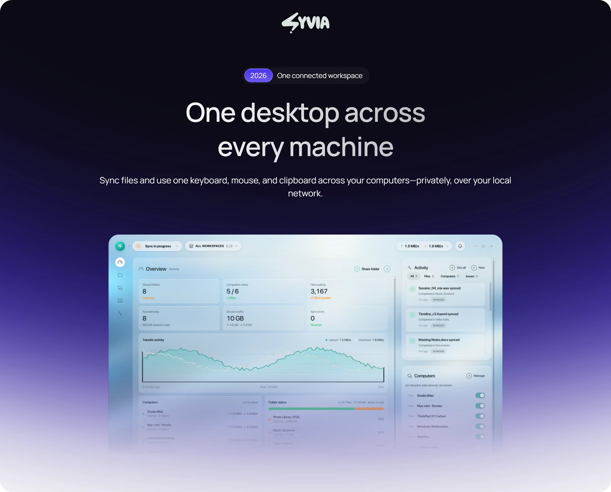
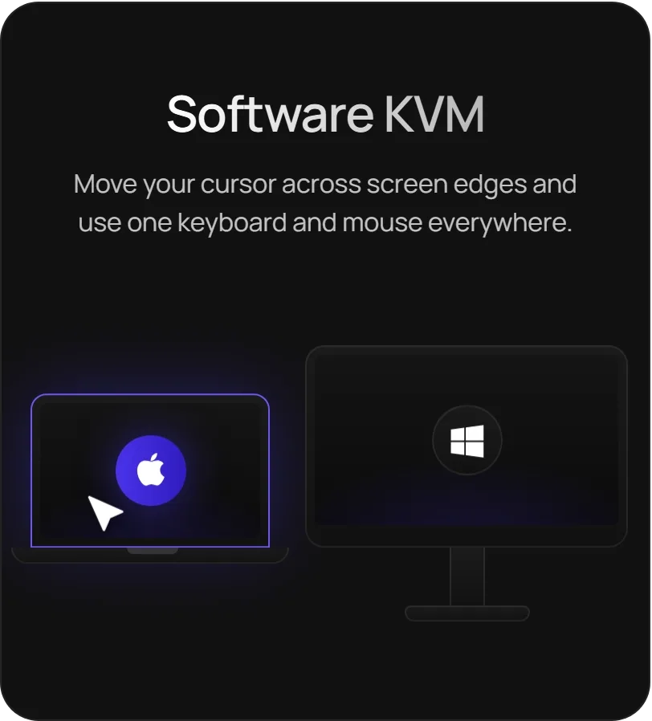
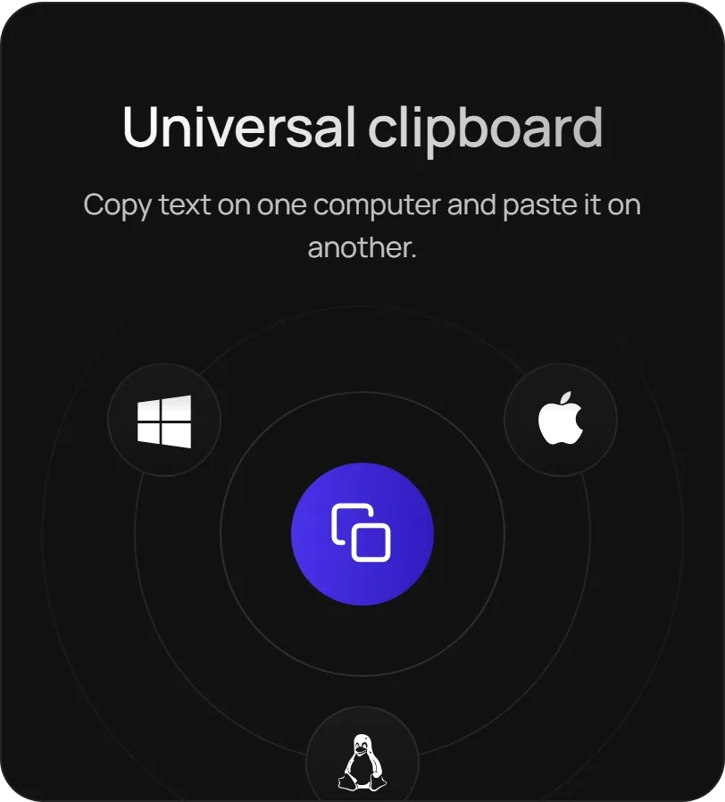
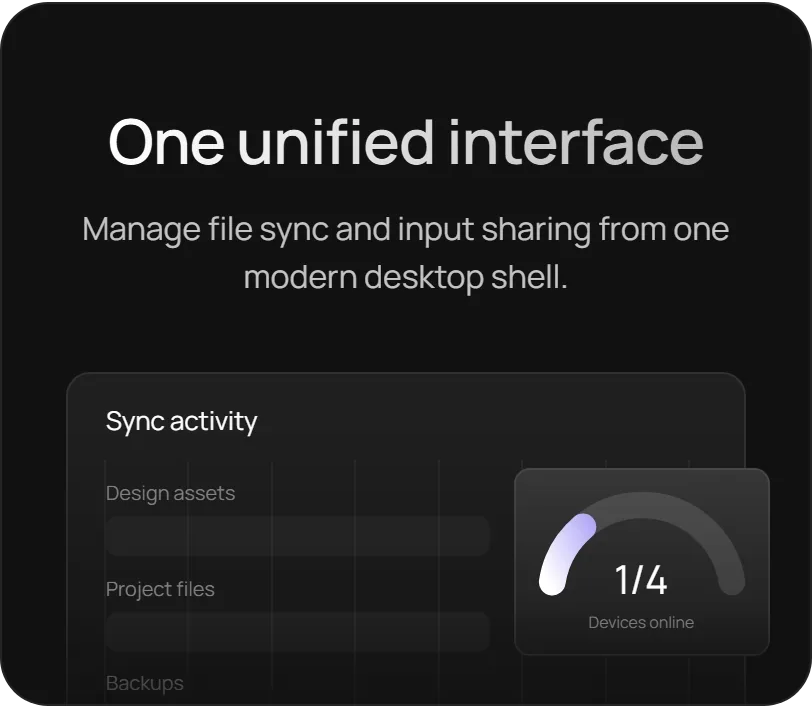
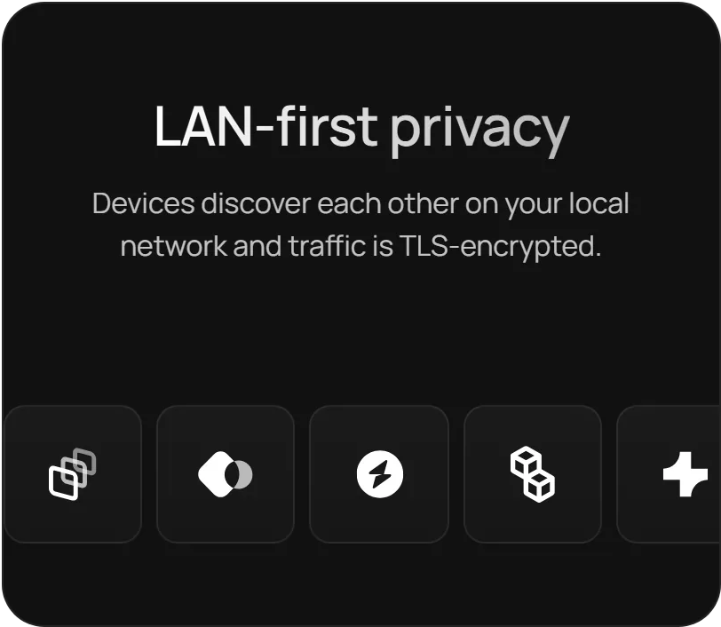

<p align="center">

</p>

<p align="center">
<a href="https://github.com/DigitxlLink-LLC/sysvia-release/releases/latest"><b>Download Sysvia 2.0.1</b></a>
&nbsp;·&nbsp;
<a href="#install">Install</a>
&nbsp;·&nbsp;
<a href="#updating-from-1x">Updating from 1.x</a>
&nbsp;·&nbsp;
<a href="#whats-new">What's new</a>
&nbsp;·&nbsp;
<a href="#set-up-a-desk">Set up a desk</a>
&nbsp;·&nbsp;
<a href="#reference">Reference</a>
</p>

## What it does

<p align="center">


</p>

<p align="center">


</p>

Sysvia keeps folders in sync between your computers and lets one keyboard and mouse control several of them. Nothing goes through a cloud service. Computers find each other on your network and talk directly.

## Install

Download the installer for your computer from the [latest release](https://github.com/DigitxlLink-LLC/sysvia-release/releases/latest). A Linux installer is not available yet.

| Computer | File |
| --- | --- |
| Windows (x64) | `Sysvia-2.0.1-win-x64.exe` |
| Mac with Apple silicon (M1 and later) | `Sysvia-2.0.1-mac-arm64.dmg` |
| Mac with an Intel processor | `Sysvia-2.0.1-mac-x64.dmg` |

**Windows.** Run the installer. It installs per machine, asks for a directory (default `C:\Program Files\Sysvia`), and adds Start menu and desktop shortcuts. It also adds Windows Firewall allow rules for Sysvia's two background services. Uninstalling removes the rules and leaves your folders and settings alone.

**macOS.** Open the `.dmg` and drag Sysvia into Applications. The app is signed and notarized by Apple. On first launch macOS asks for Local Network access, and keyboard and mouse sharing needs the permissions listed under [macOS permissions](#macos-permissions). Not sure which Mac you have? Apple menu, then About This Mac: "Chip" says Apple M1 or similar, "Processor" says Intel.

The app checks this repository for updates shortly after launch and every few hours.

<details>
<summary>Verify the download</summary>

<br>

The SHA256 of each installer is in [SHA256SUMS](SHA256SUMS). To check your copy:

```powershell
# Windows
Get-FileHash .\Sysvia-2.0.1-win-x64.exe -Algorithm SHA256
```

```sh
# macOS
shasum -a 256 ~/Downloads/Sysvia-2.0.1-*.dmg
```

</details>

## Updating

**From 2.0.0.** Just update. The app offers it, or download it above. Your computers stay paired and your folders stay as they are.

**From 1.x.** Version 2.0 replaced the file sync engine (1.x used Syncthing), and 2.0 computers cannot sync with 1.x computers. So update all of them, then set them up again:

1. Install 2.0.1 on every computer. Until every computer is updated, the ones that are not will stop syncing with the ones that are.
2. Sysvia 2.0.1 does not read your old Syncthing setup. Your files are not touched, but the folders are not added for you. On each computer, add each folder again and choose the folder you already have on disk.
3. Open **Computers** on each computer and pair them. Computers have new IDs in 2.0, so the old pairings do not carry over.
4. Share the folders between them. If both sides already hold the same files, nothing is sent again. Sysvia compares them and carries on.

If an old copy of Syncthing is still running on a computer, quit it first. It can hold the port Sysvia needs.

## What's new

### 2.0.1

A cleanup release. The last pieces of the old Syncthing-based engine are gone, and file sync is named Sysvia Sync inside the app. Nothing changes in how you use Sysvia, and pairings made in 2.0.0 carry over. The one difference is for people updating from 1.x, who now add their folders again (see [Updating](#updating)).

### 2.0

**A sync engine written for Sysvia.** Syncthing is no longer part of the app. File sync now runs on Sysvia's own engine, so the installer no longer ships any Syncthing files. On many small files it is much faster. In our tests, with two copies running on one Mac, a first sync of 3,000 small files took about 1.6 seconds. The old engine took about 15. Large files take about the same time as before.

**Built to survive a power cut.** The computer's identity and settings are written to disk in a way that survives losing power, with a backup copy next to each, so a computer keeps its ID and does not turn up as a second computer afterwards. If the index of your files is damaged, Sysvia sets it aside and rebuilds it from your folders instead of downloading everything again. A transfer that was interrupted picks up from the blocks it already had.

**Undo for receive-only folders.** A folder set to receive changes only never sends what you change on that computer. If you have edited or added things there and want it back to how the others have it, open the folder and choose **Revert local changes**. What you had is moved to the folder's trash first, not deleted.

**Removed files can be restored.** When another computer deletes or replaces a file, the old copy is kept for 7 days in `.sysvia/trash` inside the folder. A new **Recently removed files** list on the folder page shows them, with a **Restore** button on each. If the file's old place is taken, it comes back next to it as `name (restored)` and nothing is overwritten.

**Each account has its own computers and folders.** If several people sign in to Sysvia on one computer, one account no longer sees another account's computers and folders. The first account to sign in after updating keeps the existing setup. Other accounts start with their own, which also means their own ID when pairing.

## Set up a desk

Install and open Sysvia on each computer. Then:

1. On the computer whose keyboard you want to use, open **Desk** and choose **Host this desk**.
2. On the other computer, choose **Join** and enter the host's LAN address. Desk can copy it for you.
3. Wait for that computer to appear under **Active sessions**. "Nearby" only means a discovery packet arrived.
4. Open the layout, snap the other computer to the edge it physically sits on, and apply.
5. Push the pointer off that edge.

> [!NOTE]
> Both computers must be open and on the same subnet. A desktop on Ethernet and a laptop on a different Wi-Fi range will not see each other.

Keyboard sharing is optional, and leaving it off does not stop folder sync. Folders can also sync beyond your local network, if the computers can reach each other directly, for example through a forwarded port or a VPN. The desk cannot. Sysvia has no relay servers.

### Shortcuts

| Shortcut | What it does |
| --- | --- |
| `Ctrl+Alt+Esc` | Take the pointer back if it sticks on the other computer. On a Mac: `Control+Option+Esc`. |
| `Ctrl+Alt+2` | Show the other computer's primary display on this monitor. Press it again or `Esc` to close. On a Mac: `Control+Option+2`. |

<details>
<summary id="macos-permissions">macOS permissions</summary>

<br>

- **Local Network** must be allowed so Sysvia can find your other computers.
- **Accessibility** must be on for Sysvia and for `sysviad`. Restart after granting it.
- **Screen Recording** must be on for `sysviad` on any Mac whose screen you view from another computer.

</details>

## Current limits

- No Linux installer yet.
- For a folder that already exists, ignore patterns and versioning are not editable yet.
- Folder sync needs the computers to reach each other, on the same network or directly. There are no relay servers.
- The clipboard carries text only. Images, files, and dragging a file across the desk are not supported. Share a folder instead.
- Keyboard and mouse do not cross subnets, a VPN or the internet.
- The first desk connection does not ask you to compare fingerprints. The desk session (TLS, tied to the daemon's Ed25519 key) is encrypted, but the window does not show that key for approval yet. Folder transfers use device certificates.

## Reference

<details>
<summary>Network ports</summary>

<br>

| Port | Used for | Notes |
| --- | --- | --- |
| 22000 | Folder data | |
| 21037 UDP | Folder discovery on the LAN | |
| 8384 | Folder sync local API | `127.0.0.1` only. Do not publish it. |
| 24810 | Desk session | |
| 24811 | Window control | `127.0.0.1` only. |
| 24812 UDP | Desk discovery | |
| 24813 | Screen frames for the viewer | `127.0.0.1` only. |
| 5353 UDP | mDNS, `_sysvia._tcp` | |

</details>

<details>
<summary>Files on disk</summary>

<br>

Desk config, peers, role and layout live in `config.json`:

| OS | Location |
| --- | --- |
| Windows | `%APPDATA%\sysvia\config.json` |
| macOS | `~/Library/Application Support/sysvia/config.json` |
| Linux | `~/.config/sysvia/config.json` |

Stop Sysvia before editing it. The daemon rewrites the file.

Folder sync keeps its own keys, settings and index in a `sync-engine` folder in the same place. Deleting it creates a new Device ID, and other computers have to be paired again. Accounts after the first keep theirs under `sync-engine-accounts`.

Files that sync removes are kept in a `.sysvia/trash` folder inside each synced folder. That folder is never synced.

</details>

<details>
<summary>Open-source components</summary>

<br>

The folder sync engine and the desk daemon are MIT. Interface icons are [Lucide](https://lucide.dev), ISC.

</details>
