<p align="center">

</p>

<p align="center">
<a href="https://github.com/DigitxlLink-LLC/sysvia-release/releases/latest"></a>


<a href="https://discord.gg/CjT8cNeh5h"></a>
</p>

<p align="center">
<a href="https://github.com/DigitxlLink-LLC/sysvia-release/releases/latest"><b>Download Sysvia 2.4.1</b></a>
&nbsp;·&nbsp;
<a href="#new-in-241">New in 2.4.1</a>
&nbsp;·&nbsp;
<a href="https://discord.gg/CjT8cNeh5h">Join Discord</a>
&nbsp;·&nbsp;
<a href="#see-it-in-action">See it</a>
&nbsp;·&nbsp;
<a href="#install">Install</a>
&nbsp;·&nbsp;
<a href="#how-it-works">How it works</a>
&nbsp;·&nbsp;
<a href="#security">Security</a>
&nbsp;·&nbsp;
<a href="#notifications">Notifications</a>
&nbsp;·&nbsp;
<a href="#shortcuts-and-game-mode">Game mode</a>
&nbsp;·&nbsp;
<a href="#updating">Updating</a>
&nbsp;·&nbsp;
<a href="#beta-program">Beta program</a>
&nbsp;·&nbsp;
<a href="#set-up-a-desk">Set up a desk</a>
&nbsp;·&nbsp;
<a href="#reference">Reference</a>
</p>

## New in 2.4.1

<p align="center">
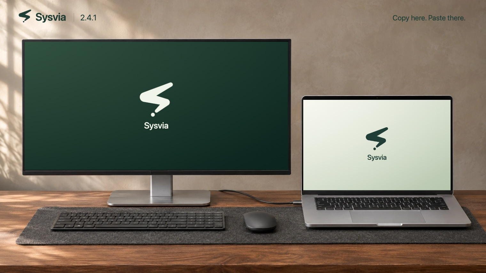
</p>

**Copy files and folders on one computer and paste them on another.** Copy in Windows Explorer with **Ctrl+C** and paste in Mac Finder with **Cmd+V**, or copy on the Mac and paste on Windows. Right-click Copy and Paste work too, as does copying between two Windows computers. Folders arrive with everything inside them.

Files usually move when you paste, over a connection of their own so the mouse and keyboard stay responsive. Keep the computer you copied on connected until the paste finishes. A Mac accepts up to **16 GB at a time**; Finder may wait while a large file arrives. A file changed since it was copied needs to be copied again. Turning **Clipboard sharing** off also turns file sharing off.

**Update both computers to 2.4.1 and quit Sysvia fully after installing.** Text, pictures and screenshots still work as before. File copy and paste is not available on Linux yet, and dragging a file between computers is not supported. Use folder sync for those transfers.

The [2.4.1 release notes](https://github.com/DigitxlLink-LLC/sysvia-release/releases/tag/v2.4.1) cover the full change. Installers are available for Windows, Apple silicon and Intel Macs, and 64-bit Linux (AppImage and Debian package).

**Also added since 2.3.5:**

- **2.4.0:** faster first opening of extended monitors, monitor windows that stay above other apps, a **Show here** button when screens are switched away, and **Ctrl+Alt+E** to send this computer's desktop to connected computers. Each computer can choose whether to ask first.
- **2.3.9:** clearer sound from another computer, with fixes for bursts of static and fewer interruptions across different networks.
- **2.3.8:** a shortcut of your choice for each computer, quick switching between connected desktops, and sound sharing from Macs running macOS 13 or later. Allowed sound starts with the remote screen, and the Sound button remembers your choice.
- **2.3.7:** cleaner screen-session disconnects and clearer handling when a computer is already lending its monitors.
- **2.3.6:** **Ctrl+Alt+3** to switch lent monitors between desktops, improved shortcut recording and confirmations, more careful pairing, and the [Sysvia Discord](https://discord.gg/CjT8cNeh5h).

See [all releases](https://github.com/DigitxlLink-LLC/sysvia-release/releases) for earlier changes.

## See it in action

The animations from [getsysvia.com](https://getsysvia.com/?utm_source=github&utm_medium=readme&utm_campaign=homepage-showcase), here in the repository. Watch the full walkthrough, or explore the short homepage demos below.

<table>
<tr>
<td width="50%" valign="top">
<h3>The full walkthrough</h3>
<a href="media/showcase/walkthrough.mp4"></a>
<p>See file sharing, keyboard and mouse, clipboard, remote screens and extended monitors in the 60-second walkthrough.</p>
<p><a href="media/showcase/walkthrough.mp4">Watch MP4</a> · <a href="https://getsysvia.com/?utm_source=github&utm_medium=readme&utm_campaign=homepage-showcase">Play on website</a></p>
</td>
<td width="50%" valign="top">
<h3>Keyboard &amp; mouse</h3>
<a href="media/showcase/keyboard-mouse.mp4"></a>
<p>One keyboard and mouse across independent desktops, with the pointer, magnifier and typing shown together.</p>
<p><a href="media/showcase/keyboard-mouse.mp4">Watch MP4</a></p>
</td>
</tr>
<tr>
<td width="50%" valign="top">
<h3>Remote screen</h3>
<a href="media/showcase/remote-screen.mp4">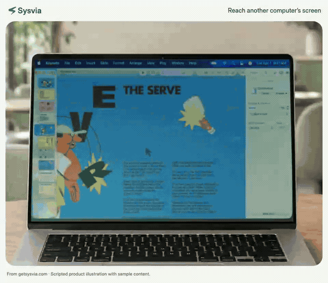</a>
<p>Move from a Mac at a café to a Windows PC, then return to the Mac.</p>
<p><a href="media/showcase/remote-screen.mp4">Watch MP4</a></p>
</td>
<td width="50%" valign="top">
<h3>Extended monitors</h3>
<a href="media/showcase/extended-monitors.mp4"></a>
<p>Move one app window across the MacBook, a borrowed PC monitor and a work laptop: three viewports into the same desktop.</p>
<p><a href="media/showcase/extended-monitors.mp4">Watch MP4</a> · <a href="https://getsysvia.com/?utm_source=github&utm_medium=readme&utm_campaign=homepage-showcase#features">Try on website</a></p>
</td>
</tr>
</table>

These are scripted website demonstrations with sample computers and screen content, not recordings of live connections or measured transfer performance. The clips use Windows and macOS example screens. [Media sources and reproduction](media/showcase/README.md).

<details>
<summary>More from the walkthrough: files, clipboard and screens</summary>

Five clips from the website walkthrough, with sample computers and files. Connections and transfers are scripted for the demo.

<table>
<tr>
<td width="50%" valign="top">
<h3>File sharing</h3>
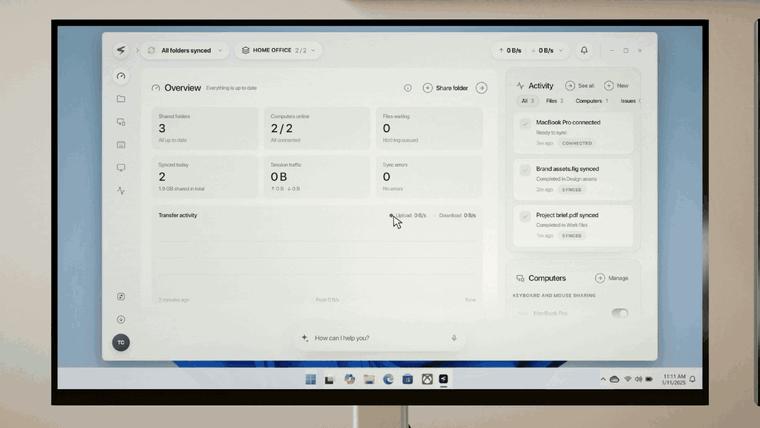
<p>Share a folder on your PC and make it available on your Mac.</p>
</td>
<td width="50%" valign="top">
<h3>Clipboard</h3>
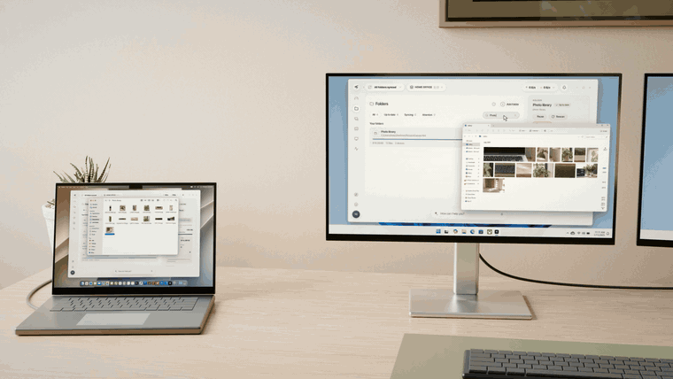
<p>Copy text, an image or a screenshot, then paste on another computer.</p>
</td>
</tr>
<tr>
<td width="50%" valign="top">
<h3>Keyboard &amp; mouse</h3>

<p>Cross the screen edge and keep typing on the next computer.</p>
</td>
<td width="50%" valign="top">
<h3>Remote screen</h3>
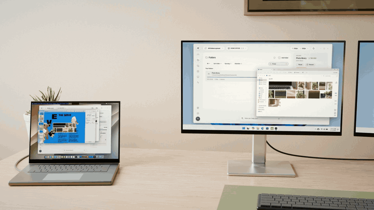
<p>Reach your PC screen from your Mac.</p>
</td>
</tr>
<tr>
<td width="50%" valign="top">
<h3>Extended displays</h3>

<p>Spread your Mac across your PC&rsquo;s monitors.</p>
</td>
<td width="50%" valign="top">
<h3>Watch the whole flow</h3>
<p>See how the five features fit together in the full walkthrough, or explore the interactive homepage cards.</p>
<p><a href="media/showcase/walkthrough.mp4">Watch the full MP4</a> · <a href="https://getsysvia.com/?utm_source=github&amp;utm_medium=readme&amp;utm_campaign=homepage-showcase#features">Try the homepage demos</a></p>
</td>
</tr>
</table>

</details>

## What it does

Sysvia keeps folders in sync between your computers and lets one keyboard and mouse control several of them. Computers connect directly whenever possible, without storing your files in a cloud drive. For computers on different networks, Sysvia can use its relay when a direct connection is unavailable.

| | |
| --- | --- |
| **Folder sync** | Continuous, peer to peer, on Sysvia's own engine. Receive-only folders, a 7-day undo for removed files, interrupted transfers that resume, and renames that move at once. |
| **Workspaces** | Group your computers the way you use them, like a home office or a studio, and choose which of them show notifications. |
| **Input sharing** | One keyboard and mouse across several computers, set up as a desk. Push the pointer off a screen edge and it lands on the next machine. |
| **Remote screen and sound** | See and use another computer's screen from yours, once the person at it allows that. Listen to its sound when separately allowed; a Mac sharing sound needs macOS 13 or later. |
| **Extended monitors** | Use another computer's monitors as extra screens on this one, with no cable. Set a shortcut for each computer and switch between connected desktops without reconnecting. |
| **Clipboard** | Copy text, pictures or screenshots on one computer and paste on another. Files and folders also paste between Windows and Mac, and between Windows computers, when linked on the same network. |
| **Shortcuts and game mode** | Keys that work from anywhere on the computer, and a game mode that stops the keyboard and mouse from leaving it while you play. |
| **Notifications** | Desktop alerts when a computer connects, files arrive, something fails, or an update is ready. |
| **Connect from anywhere** | Let computers on different networks find each other through your account. See [Connect from anywhere](#connect-from-anywhere). |
| **Private by design** | Encrypted connections between your computers, with no cloud file storage. Screen viewing, control and sound sharing each need permission. See [Security](#security). |

## How it works

Install Sysvia on each computer and sign in. Your computers can find each other on the same network. Computers on another account wait for you to accept them before connecting.

Choose which folders to share, then set up a desk if you also want one keyboard and mouse across your computers. Folder sync and input sharing can be used independently. Remote screens and extended monitors have their own permission controls.

### Connect from anywhere

To reach computers on different networks, sign in to the same account and open **Settings, General, Connect from anywhere** on both computers. Turn on **Use my Sysvia account to introduce my computers** and keep Sysvia running on both. They try a direct connection first and can use Sysvia's relay when needed. Relay availability and usage limits depend on your account; see [getsysvia.com](https://getsysvia.com) for current license details.

Keyboard and mouse sharing across screen edges still needs the same local network. For a computer elsewhere, open its remote screen instead.

## Security

Connections between your computers are encrypted. Your files stay on your computers rather than in a cloud drive.

- **You choose which computers connect.** Computers outside your account wait for you to accept them.
- **You allow screen access.** Choose which computers may view or control a screen. A sharing bar shows when someone is looking or listening.
- **Sound needs its own permission.** Listening starts only after the sharing computer allows it, and the viewer can turn it off with the Sound button.
- **You can take input back.** Press **Ctrl+Alt+Esc** (Mac: **Control+Option+Esc**) to return the keyboard and mouse to this computer.

Found a security problem? Please tell us privately at [support@getsysvia.com](mailto:support@getsysvia.com).

## Screens

The Sysvia interface in Sage, shown with sample computers and files. Select any screenshot to view it at full size.

<table>
<tr>
<td width="50%" valign="top">
<h3>Overview</h3>
<a href="media/screenshots/overview.webp">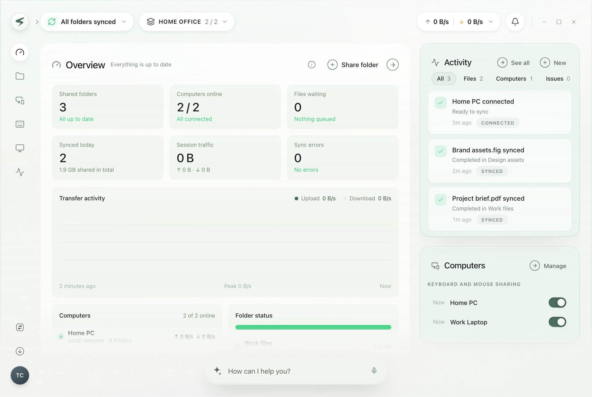</a>
<p>Your computers, folders and recent activity in one place.</p>
</td>
<td width="50%" valign="top">
<h3>Folders</h3>
<a href="media/screenshots/folders.webp"></a>
<p>Check sync progress, file counts and the computers sharing each folder.</p>
</td>
</tr>
<tr>
<td width="50%" valign="top">
<h3>Computers</h3>
<a href="media/screenshots/computers.webp">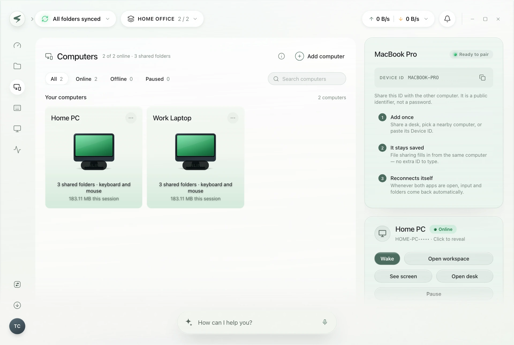</a>
<p>Manage connected computers and open their screens or desks.</p>
</td>
<td width="50%" valign="top">
<h3>Input sharing</h3>
<a href="media/screenshots/input-sharing.webp">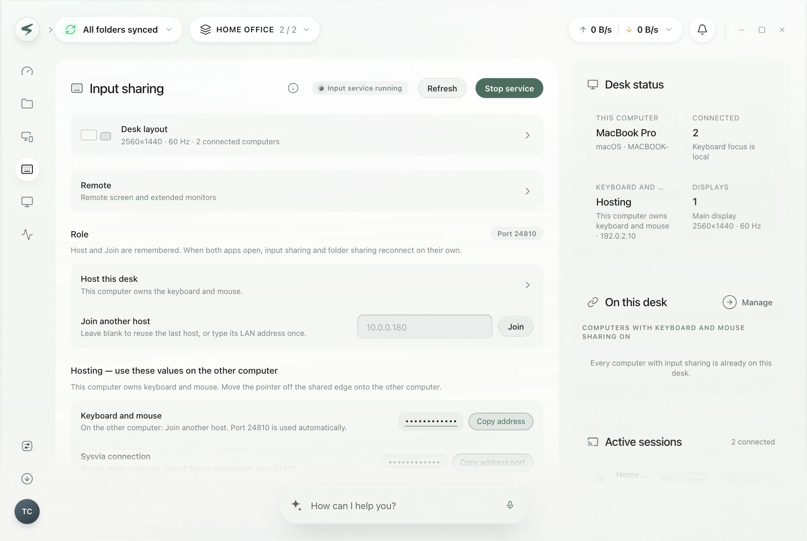</a>
<p>Host a desk or join another computer to share your keyboard and mouse.</p>
</td>
</tr>
<tr>
<td width="50%" valign="top">
<h3>Desk layout</h3>
<a href="media/screenshots/desk-layout.webp">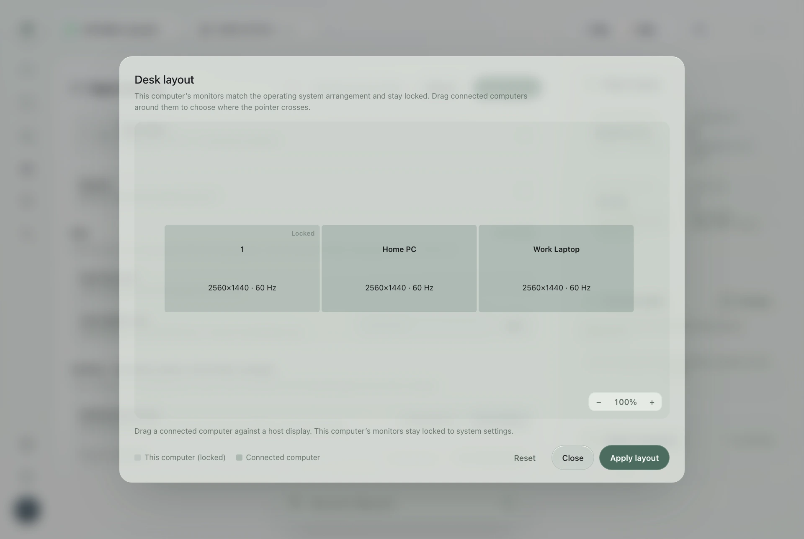</a>
<p>Arrange computers beside the screen edges where your pointer should cross.</p>
</td>
<td width="50%" valign="top">
<h3>Clipboard settings</h3>
<a href="media/screenshots/clipboard-settings.webp">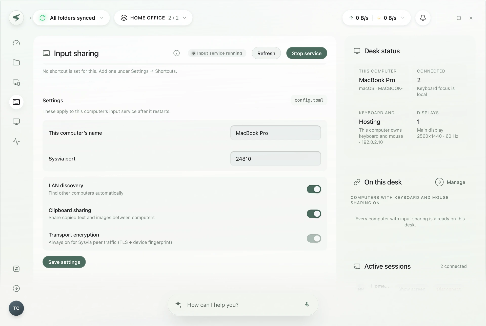</a>
<p>Control clipboard sharing and automatic discovery from the input settings.</p>
</td>
</tr>
<tr>
<td width="50%" valign="top">
<h3>Remote screen</h3>
<a href="media/screenshots/remote-screen.webp"></a>
<p>Open another computer’s screen or choose how to share monitors.</p>
</td>
<td width="50%" valign="top">
<h3>Extended monitors</h3>
<a href="media/screenshots/extended-monitors.webp">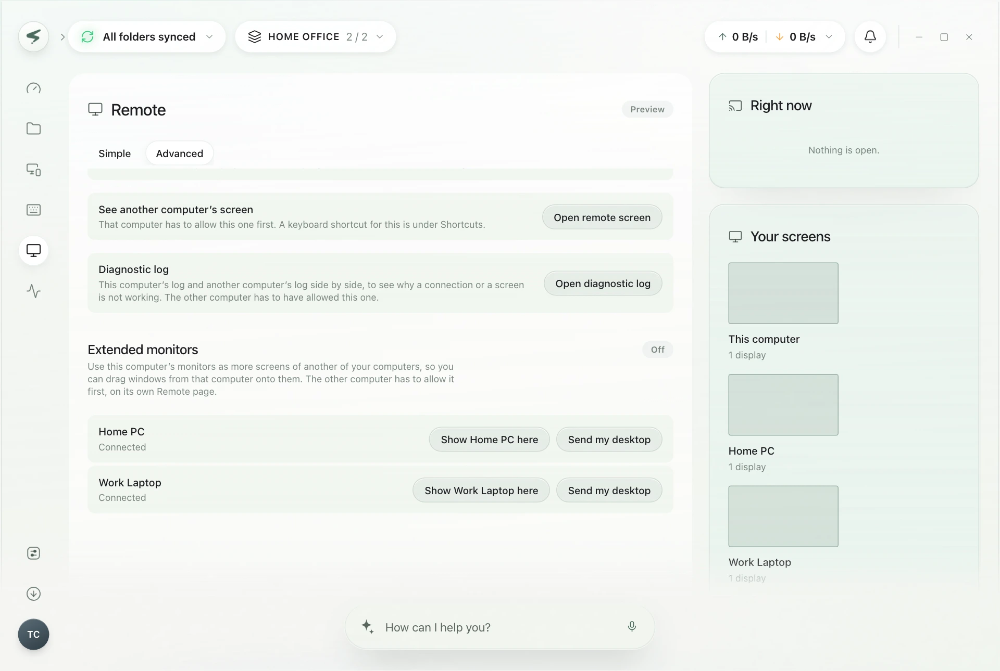</a>
<p>Choose a computer to show here or send your desktop to another screen.</p>
</td>
</tr>
</table>

[Screenshot details and capture instructions](media/screenshots/README.md).

## Install

Download the installer for your computer from the [latest release, Sysvia 2.4.1](https://github.com/DigitxlLink-LLC/sysvia-release/releases/latest). Create an account at [getsysvia.com](https://getsysvia.com) and sign in to the app; see the website for current license options.

| Computer | File |
| --- | --- |
| Windows (x64) | `Sysvia-<version>-win-x64.exe` |
| Mac with Apple silicon (M1 and later) | `Sysvia-<version>-mac-arm64.dmg` |
| Mac with an Intel processor | `Sysvia-<version>-mac-x64.dmg` |
| Linux, 64-bit (any distribution) | `Sysvia-<version>-linux-x86_64.AppImage` |
| Linux, Debian or Ubuntu, 64-bit | `Sysvia-<version>-linux-amd64.deb` |

In the file names, `<version>` is the number of the release you download. The [Releases page](https://github.com/DigitxlLink-LLC/sysvia-release/releases) has the release notes for every version.

**Windows.** Run the installer. It installs per machine, asks for a directory (default `C:\Program Files\Sysvia`), and adds Start menu and desktop shortcuts. Allow the installer to set up the network access Sysvia needs.

**macOS.** Open the `.dmg` and drag Sysvia into Applications. The app is signed and notarized by Apple. On first launch macOS asks for Local Network access, and keyboard and mouse sharing needs the permissions listed under [macOS permissions](#macos-permissions). Not sure which Mac you have? Apple menu, then About This Mac: "Chip" says Apple M1 or similar, "Processor" says Intel.

**Linux.** For the AppImage, make it executable (`chmod +x Sysvia-<version>-linux-x86_64.AppImage`) and run it. For the `.deb`, install it with your package manager, for example `sudo apt install ./Sysvia-<version>-linux-amd64.deb`. Both are 64-bit builds. Keyboard and mouse sharing depends on your desktop session, and native Wayland input support is still in development.

The app checks this repository for updates a few seconds after launch, every ten minutes while it is running, and when you come back to its window or wake the computer.

<details>
<summary>Verify the download</summary>

<br>

The SHA256 of each 2.4.1 installer and macOS update ZIP is in [SHA256SUMS](SHA256SUMS), followed by checksums for earlier downloads. To check your copy:

```powershell
# Windows
Get-FileHash .\Sysvia-*-win-x64.exe -Algorithm SHA256
```

```sh
# macOS
shasum -a 256 ~/Downloads/Sysvia-*.dmg
```

```sh
# Linux
sha256sum ~/Downloads/Sysvia-*-linux-*
```

</details>

## Notifications

Sysvia can tell you about things while it sits in the tray, on Windows and macOS. It watches the sync engine itself, so alerts arrive whether or not the window is open.

| You get a notification when | Example |
| --- | --- |
| A computer connects | **Studio PC connected** |
| A computer has been offline for more than 30 seconds, and again when it is back | **Studio PC went offline**, then **Studio PC is back online** |
| Files arrive from another computer | **cover.psd from Studio PC in Photos**, or **From Studio PC: 3 files updated** |
| A folder has a problem | **Photos needs attention**, or **Photos stopped syncing** |
| An update is available | **Update available**, once for each new version |

Alerts are kept calm on purpose:

- A computer that drops and returns inside 30 seconds is not announced, and connections made during the first 30 seconds after launch are not either.
- Files that arrive close together are grouped into one alert per folder instead of one per file.
- A folder that keeps failing is reported once every few minutes, not on every retry.
- Nothing is shown while the Sysvia window is in front of you. The app already shows it.
- Only the big events play a sound: updates, errors, and a folder finishing a large sync (10 or more files, or a sync that took 20 seconds or longer). Connections and small syncs are silent.
- Notifications cover files that arrive from your other computers, not changes you make on this one.

Clicking an alert brings Sysvia forward and opens the page it was about: Computers for connections, Folders for syncs and problems.

**Settings.** Open the bell at the top of the window, then the settings icon. Under **What should pop up on this computer?** choose **Everything**, **Important only** or **Off**. **More options** has the fine controls: **Desktop notifications** turns every alert off at once; **File syncs**, **Connections**, **Errors and alerts** and **Updates** switch each kind. Your choices are kept even when the window is closed to the tray. **Sound** turns Sysvia's notification sound on or off.

**Which computers show them.** Each workspace has a **Show notifications on** list, and every computer shows notifications until you untick it. Set it in the workspace editor, on the workspace card, or in the bell menu, where one switch per workspace controls this computer. It only holds back connection and file-sync pop-ups: problems, updates and security alerts always show, and a muted computer still lists everything in the bell menu. The choice follows your account. **Quiet hours** holds desktop alerts between two times you choose, across midnight if needed; the bell list still records them. **Send a test notification** shows a real alert and tells you why one did not appear: switched off, held by quiet hours, refused by the system, or hidden by Focus assist or Do Not Disturb.

**macOS.** Allow notifications for Sysvia the first time macOS asks, or later under System Settings, Notifications, Sysvia. Focus modes and Do Not Disturb hide them, as with any app.

**Windows.** Alerts come from the installed app and follow Focus assist. If you do not see them, check Settings, System, Notifications.

## Updating

**From 2.0.0 or later.** Use the update offered by the app, or download the latest installer above. Your computers stay paired and your folders stay as they are. Update every computer to **2.4.1**, then quit Sysvia fully and reopen it so every computer is running the new version. Cross-platform file copy and paste needs the new version on both ends.

**From 1.x.** Version 2.0 replaced the file sync engine (1.x used Syncthing), and 2.0 computers cannot sync with 1.x computers. So update all of them, then set them up again:

1. Install the latest version on every computer. Until every computer is updated, the ones that are not will stop syncing with the ones that are.
2. Current Sysvia versions do not read your old Syncthing setup. Your files are not touched, but the folders are not added for you. On each computer, add each folder again and choose the folder you already have on disk.
3. Open **Computers** on each computer and pair them. Computers have new IDs in 2.0, so the old pairings do not carry over.
4. Share the folders between them. If both sides already hold the same files, nothing is sent again. Sysvia compares them and carries on.

If an old copy of Syncthing is still running on a computer, quit it first. It can hold the port Sysvia needs.

## Beta program

Want to try what is coming before it is released? Members with an active license can join the beta. You get new builds first, tell us what breaks, and get a **Beta tester** badge on your profile in the app and on the website.

1. Open **Settings**, then **Updates**, and find **Beta program**. You can also use **Account** on [getsysvia.com](https://getsysvia.com/dashboard).
2. Read the [Beta Program Terms](https://getsysvia.com/beta-terms), tick the box, and choose **Join the beta**.

From then on Sysvia looks for new builds in the [beta releases](https://github.com/DigitxlLink-LLC/sysvia-beta-release/releases/latest) instead of here. Beta builds can be unstable, so keep a backup of anything you cannot afford to lose.

**Leaving** takes one click: **Leave the beta** in the same place. Sysvia goes back to the releases here and your badge is removed. If this computer is running a beta build, leaving in the app also switches it back to the latest public release: Sysvia downloads it and restarts. If you left on the website, use **Switch to the stable release** in the same place in the app.

## Set up a desk

Install and open Sysvia on each computer. Then:

1. On the computer whose keyboard you want to use, open **Input sharing** and choose **Host this desk**.
2. On the other computer, choose **Join** and enter the host's LAN address. Input sharing can copy it for you.
3. Wait for that computer to appear under **Active sessions**. "Nearby" only means a discovery packet arrived.
4. Open the layout, snap the other computer to the edge it physically sits on, and apply.
5. Push the pointer off that edge.

> [!NOTE]
> Both computers must be open and on the same subnet. A desktop on Ethernet and a laptop on a different Wi-Fi range will not see each other.

Keyboard sharing is optional, and leaving it off does not stop folder sync. For folders and remote screens across different networks, see [Connect from anywhere](#connect-from-anywhere).

## Shortcuts and game mode

These work from anywhere on the computer, even while a game or another app is in front.

| Shortcut | What it does |
| --- | --- |
| `Ctrl+Alt+Esc` | Take the pointer back if it sticks on the other computer. On a Mac: `Control+Option+Esc`. Built in, so it always works, and it cannot be changed. |
| `Ctrl+Alt+G` | Turn game mode on or off. On a Mac: `Control+Option+G`. |
| `Ctrl+Alt+2` | Show the other computer's primary display on this monitor. Press it again or `Esc` to close. On a Mac: `Control+Option+2`. |
| `Ctrl+Alt+D` | Open remote screen to another of your computers. On a Mac: `Control+Option+D`. |
| `Ctrl+Alt+1` | While another computer's monitors are added to yours, flip the keyboard and mouse between this computer and that one. On a Mac: `Control+Option+1`. |
| `Ctrl+Alt+3` | Switch lent monitors between this computer and the other computer’s desktop. |
| `Ctrl+Alt+E` | Send this computer's desktop to connected computers. Each receiving computer asks first unless you allowed it without asking. |
| `Ctrl+Alt+S` | Bring the Sysvia window to the front. |
| Your choice | **Show [computer] on these monitors**, one shortcut for each other computer. The first press connects, another computer's shortcut switches to it, and pressing the current computer's shortcut returns to this desktop. |

Everything except `Ctrl+Alt+Esc` can be changed under **Settings, Shortcuts**.

**Game mode** is for the computer that is sharing its keyboard and mouse (the host). While it is on, the pointer no longer crosses to another computer and your input stays on this one. Turn it on from the **Input sharing** page or with `Ctrl+Alt+G`. It always starts off when Sysvia launches and turns itself off if you stop hosting. On Windows it also holds the cursor on the monitor your game is on. Taking the keyboard back with `Ctrl+Alt+Esc` releases it.

**Shortcut confirmation.** An icon, the Sysvia name and a clear status appear briefly over your apps. Turn confirmations off under **Settings, Shortcuts**.


<details>
<summary id="macos-permissions">macOS permissions</summary>

<br>

- **Local Network** must be allowed so Sysvia can find your other computers.
- **Accessibility** must be on for Sysvia and for `sysviad`. Restart after granting it.
- **Screen Recording** must be on for `sysviad` on any Mac whose screen you view from another computer.
- For remote screen macOS also asks about **Screen Recording** and **Accessibility** the first time someone looks at, or controls, this Mac. Allow the entries named Sysvia. Only the person at the Mac can do this.
- Sharing a Mac's sound needs **macOS 13 or later** and **Screen Recording** permission, plus permission for the listening computer in Sysvia.
- **Notifications** should be allowed if you want [desktop alerts](#notifications).

</details>

## Current limits

- Using a Mac as an extra monitor for a Windows PC is a preview: the picture can be much less smooth than the other direction.
- Linux installers are 64-bit only (AppImage and `.deb`), and native Wayland input support is still in development.
- For a folder that already exists, ignore patterns and versioning are not editable yet.
- Folder sync needs both computers connected, either directly or through Sysvia's relay. Relay usage is subject to your account's allowance.
- The clipboard carries text and images (up to 10 MB each). Files and folders can be pasted between Windows and Mac, and between Windows computers, on the same network with both computers on 2.4.1. Keep the source computer connected until the paste finishes. A Mac accepts up to 16 GB at a time. Linux file copy and paste and dragging files between computers are not supported yet; use folder sync instead.
- Keyboard and mouse do not cross subnets, a VPN or the internet.
- Remote screen and extended monitors need the computers to connect on one network or with [Connect from anywhere](#connect-from-anywhere) on both. The connection and any relay allowance affect the available quality and speed.
- A Windows PC can lend its monitors only after the virtual display driver is installed (Windows 11, 64-bit).
- Game mode keeps the cursor on one monitor on Windows only. On a Mac it only stops the pointer crossing to another computer.

## Community and support

**[Join the Sysvia Discord](https://discord.gg/CjT8cNeh5h)** to ask questions, report problems, suggest features and share your setup. Release announcements are posted there too.

When reporting a problem, include your Sysvia version, the operating systems on both computers, what you expected and what happened. You can find the app version under **Settings, Updates**.

For private support or security reports, email [support@getsysvia.com](mailto:support@getsysvia.com).

## Reference

<details>
<summary>Files on disk</summary>

<br>

Desk config, peers, role and layout live in `config.json`:

| OS | Location |
| --- | --- |
| Windows | `%APPDATA%\sysvia\config.json` |
| macOS | `~/Library/Application Support/sysvia/config.json` |
| Linux | `~/.config/sysvia/config.json` |

Stop Sysvia before editing it. The daemon rewrites the file.

Folder sync keeps its own keys, settings and index in a `sync-engine` folder in the same place. Deleting it creates a new Device ID, and other computers have to be paired again. Accounts after the first keep theirs under `sync-engine-accounts`.

Files that sync removes are kept in a `.sysvia/trash` folder inside each synced folder. That folder is never synced.

Notification choices are kept in `notification-preferences.json`, and shortcut choices in `shortcut-preferences.json`, in the app's data folder.

</details>

<details>
<summary>Open-source components</summary>

<br>

The folder sync engine and the desk daemon are MIT. Interface icons are [Lucide](https://lucide.dev), ISC.

</details>
